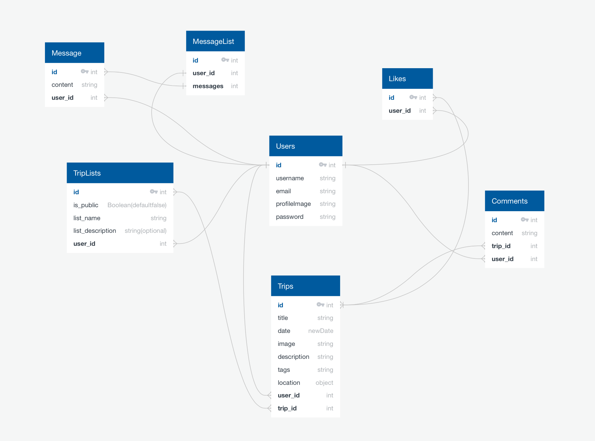
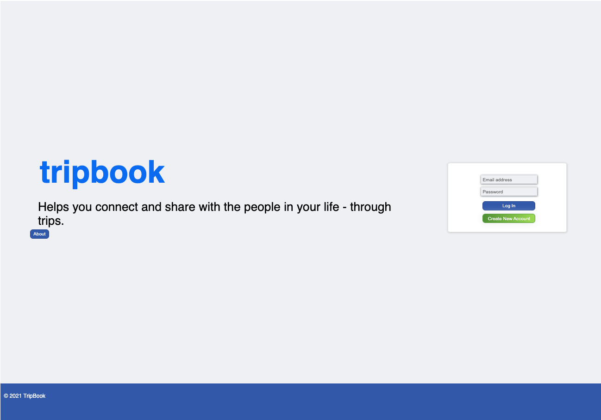
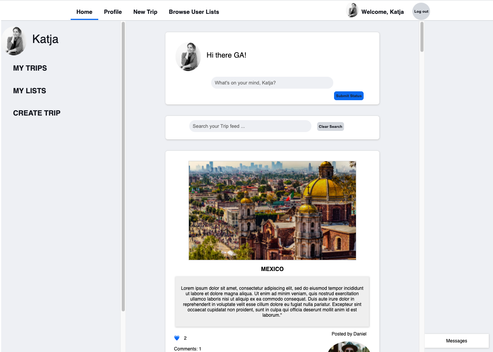

 GENERAL ASSEMBLY — SOFTWARE ENGINEERING IMMERSIVE 2021

# TripBook
## Project 4

A social media network that allows users to create a profile for themselves, share favourite past trips they have been on and create and manage wish lists for future trips. 

[Try it out.](https://tripbook.netlify.app/)

For the best user experience I would recommend to register with a name and profile photo, to fully see the customisation per user across the app. 


## Table of Contents

1. [Brief](https://github.com/khackethal/project-4-client#brief)
2. [Approach](https://github.com/khackethal/project-4-client#brief)
   - [MVP](https://github.com/khackethal/project-4-client#mvp)
   - [Technologies](https://github.com/khackethal/project-4-client#technologies-frameworks-apis)
   - [Methodologies](https://github.com/khackethal/project-4-client#methodologies)
3. [Planning](https://github.com/khackethal/project-4-client#planning)
   - [Back End](https://github.com/khackethal/project-4-client#back-end-1)
   - [Front End](https://github.com/khackethal/project-4-client#front-end-1)
4. [Project Frames](https://github.com/khackethal/project-4-client#project-frames)
5. [Wins & Challenges](https://github.com/khackethal/project-4-client#wins-challenges--bugs)
6. [Key Learnings and Future Features](https://github.com/khackethal/project-4-client#key-learnings--future-features)


## Brief

Create a full-stack application with its own Front End and Back End. Use a Python Django API, using a Django REST Framework to serve data from a Postgres Database. Consume the API with a React front end.  
Create a complete product with multiple relationships and CRUD functionality. Implement thoughtful user stories and have a visually impressive design. Deploy online so it's publicly accessible.

## Approach

### MVP

My main priority was creating a seamless user experience, allowing a journey through the app that makes sense, and interlinking all related components. The most important elements and main targets were:

- Login and Register functionality, with all content available after login only as the app experience requires a user profile
- Customisation of the Navbar and SideBar for each user, giving them easy and fast access to all trips they posted and all lists they created
- Displaying all trips on a homepage as easily searchable 'feed'
- The ability to easily view other users lists, and add any trips within them to the user's own lists
- Easy travel through the app between trips, lists and other user profiles, with everything the user would expect to be a link actually being one
- Building the entire React frontend with pure CSS from scratch, not using any libraries or frameworks

A stretch goal I didn't have time to implement was a messaging functionality between users, which I might revisit in the coming weeks. Please see below for other future features.


### Technologies/ Frameworks/ APIs

#### Back End
- PostgreSQL
- Django
- Pylint
- Psycopg2 Binary
- Django
- Django Reast Framework
- Djano Rest Framework Camel Case

#### Front End
- Axios
- Cloudinary
- React
- React Router
- React Map GL
- React Map Gl Geocoder
- React Confirm Alert
- React Loader Spinner
- React Responsive Carousel
- Mapbox
- Moment
- Node.js


### Methodologies
- Write readable, simple, DRY code per KISS
- Create reusable components that have a clear, specific task 

N. B it was optional to work in groups for this project, I chose to work solo to ensure I have clearly understood all aspects of creating both the Back End and the Front End, and to consolidate existing CSS skills. 


## Planning

I spent a great deal of time in the planning phase, thinking through the Back End relationships and the user journey through the app. Below are my initial diagrams for both Back End and Front End, the finished app hardly deviates from them due to the extended planning phase.


### Back End 

### Entity Relationship Diagram

The below diagram was created using [ Quick Db.](https://www.quickdatabasediagrams.com/)


<p>

</p>


#### The Trip Model:

The most important model is the trip itself, as it unites the relationships between creators, likes, comments and lists.

```python

class Trip(models.Model):
    location_id = models.CharField(max_length=20, blank=True)
    name = models.CharField(max_length=50)
    latitude_longitude = ArrayField(models.FloatField(max_length=50, blank=True))
    description = models.TextField(max_length=500)
    image = models.CharField(max_length=250)

    liked_by = models.ManyToManyField(
        'jwt_auth.User',
        related_name='likes',
        blank=True
    )

    listed_by = models.ManyToManyField(
        'jwt_auth.User',
        related_name='lists',
        blank=True
    )

    owner = models.ForeignKey(
        'jwt_auth.User',
        related_name='created_trips',
        on_delete=models.CASCADE
    )

    def __str__(self):
        return f'{self.name} in {self.location_string}'
```


The lists themselves have extensive views for the user to interact with, similar to the ones written for the original trips.

```python
## VIEW ALL TRIP LISTS
class UserTripListView(APIView):   
    permission_classes = (IsAuthenticated, )
    def get(self, _request):
        lists = UserTripList.objects.all()
        serialized_trips = PopulatedUserTripListSerializer(lists, many=True)
        return Response(serialized_trips.data, status=status.HTTP_200_OK)
    
## POST A NEW LIST
    def post(self, request):
        request.data['owner'] = request.user.id
        new_list = UserTripListSerializer(data=request.data)
        if new_list.is_valid():
            new_list.save()
            return Response(new_list.data, status=status.HTTP_201_CREATED)
        return Response(new_list.errors, status=status.HTTP_422_UNPROCESSABLE_ENTITY)


## VIEW A SINGLE LIST and METHODS
class UserTripListDetailView(APIView):
    permission_classes = (IsAuthenticated, )
#FIND MATCH
    def get_list(self, pk):
        try:
            return UserTripList.objects.get(pk=pk)
        except UserTripList.DoesNotExist:
            raise NotFound()
# SHOW ONE
    def get(self, _request, pk):
        user_list = self.get_list(pk=pk)
        serialized_list = PopulatedUserTripListSerializer(user_list)
        return Response(serialized_list.data, status=status.HTTP_200_OK)

# DELETE LIST
    def delete(self, request, pk):
        list_to_delete = self.get_list(pk=pk)
        if list_to_delete.owner != request.user:
            raise PermissionDenied()
        list_to_delete.delete()
        return Response(status=status.HTTP_204_NO_CONTENT)

## RENAME LIST OR CHANGE PRIVACY SETTINGS 
    def put(self, request, pk):
        list_to_update = self.get_list(pk=pk)
        if list_to_update.owner != request.user:
            raise PermissionDenied()
        request.data['owner'] = request.user.id
        updated_list = UpdatedUserTripListSeralizer(list_to_update, data=request.data)
        if updated_list.is_valid():
            updated_list.save()
            return Response(updated_list.data, status=status.HTTP_202_ACCEPTED)
        return Response(updated_list.errors, status=status.HTTP_422_UNPROCESSABLE_ENTITY)
```

Another noteworthy feature of the backend is the tweaked the login return, which returns the user id, enabling me to write a simple Front End React Hook for every component to use to identify the current user and update the component render immediately on user changes (detailed in FrontEnd section).

```python

class LoginView(APIView):

    def post(self, request):
        email = request.data.get('email')
        password = request.data.get('password')

        try:
            user_to_login = User.objects.get(email=email)
        except User.DoesNotExist:
            raise PermissionDenied({'detail': 'Unauthorized'})

        if not user_to_login.check_password(password):
            raise PermissionDenied({'detail': 'Unauthorized'})

        expiry_time = datetime.now() + timedelta(days=7)
        token = jwt.encode(
            {'sub': user_to_login.id, 'exp':  int(expiry_time.strftime('%s'))},
            settings.SECRET_KEY,
            algorithm='HS256'
        )
        return Response(
            {'token': token, 'userId': user_to_login.id ,'message': f'Welcome back {user_to_login.username}'}
        )
```

### Front End

The front end is a React app, using the following wireframes. 
The below frames have been tweaked slightly for the final app, as I felt it would be beneficial for the user and create a more seamless experience to reduce the number of pages and page changes.
The below wireframes were created using [ Excalidraw. ](https://excalidraw.com/) 

##

<p>

</p>

##


I mentioned the User Hook above, it enables the app to be highly personalised.

On login, the user id returned by the Back End is stored in local storage: 

```js
export function setUserId(userId) {
  window.localStorage.setItem('userId', userId)
  console.log(`userId has been set to ${userId}`)
}

export function getUserId(){
  return window.localStorage.getItem('userId')
}

export function removeUserId(){
  window.localStorage.removeItem('userId')
}
```

This user hook using uses the id to set the current user:

```js
import React from 'react'
import { getUserId } from '../../lib/auth'
import { userProfileView } from '../../lib/api'

function useSetUser() {

  const userId = getUserId()
  const [user, setUser] = React.useState(null)
  const [error, setIsError] = React.useState(false)

  React.useEffect(() => {
    const getData = async () => {
      try {
        const result = await userProfileView(userId)
        setUser(result.data)
      } catch (e) {
        setIsError(true)
      }
    }
    getData()
  },[userId])

  return {
    user,
    setUser,
    error,
    setIsError,
  }
}

export default useSetUser
```

Every component can then use a single line of code to determine the current user and modify the component's contents accordingly.
```js
 const { user, setUser } = useSetUser()
```

Exporting setUser as well means we can instantly re-render the component after the user makes a change, for example updating the status in the status box component, or after uploading a new profile image.
This enables customisation and responsiveness across the app. The Status Box component is listed as an example use case below.

```js
import React from 'react'
import useSetUser from '../hooks/SetUser'
import { useForm } from '../hooks/useForm'
import { editUserProfile } from '../../lib/api'
import Loader from 'react-loader-spinner'
import Error from '../auth/Error'


function StatusBox() {

  const { user, setUser } = useSetUser()
  const userId = user?.id
  const [ statusPlaceholder, setStatusPlaceholder ] = React.useState(null)
  const [error, setIsError] = React. useState(false)

  const { formData, handleChange } = useForm({
    status: '',

  })
  
  const handleStatusSubmit = async (e) => {
    e.preventDefault()

    try {
      const res = await editUserProfile(userId, formData)
      console.log('res', res.data)
      setStatusPlaceholder(`What's on your mind, ${user.username}?`)
      setUser( { ...user, status: res.data.status })

    } catch (err) {
      setIsError(true)
    }
  }


  return (
    <>
      { user?.username ? 
        <div >
          
          <p className="status-paragraph">{user?.status}</p> 
          <div className="input-div">
            <input 
              name="status" 
              onChange={handleChange}
              className="status-input" 
              width="100px"
              placeholder= {statusPlaceholder ?  { statusPlaceholder } : `What's on your mind, ${user?.username}?`}></input>
          </div>
          <div className="status-button-div">
            <button onClick={handleStatusSubmit} className="status-button">Submit Status</button>
          </div>
        </div> : 
        <Loader
          type="ThreeDots"
          color="#1877F2"
          height={100}
          width={100}
          timeout={3000} 
        />}
      {error && <Error />}
    </>
  )
}

export default StatusBox
```


The main feature of the app is the ability to create future tip wish-lists by adding trips other users have posted. User have the opportunity to set their lists as either "public" (visible to all other users) or "private"(visible only to them). 
This is achieved simply by a tick-box setting a boolean list property "isPublic" to false if the user selects it as per the code below.
In any public pages lists will be filtered to only be displayed if "isPublic" is true.

```js
import React from 'react'
import { useHistory } from 'react-router-dom'

import useSetUser from '../hooks/SetUser'
import { useForm } from '../hooks/useForm'
import { createNewList } from '../../lib/api'
// eslint-disable-next-line
import Error from '../auth/Error'
import Loader from 'react-loader-spinner'


function CreateNewList() {

  const { user } = useSetUser()
  const [ Error, setIsError ] = React.useState(false)
  const history = useHistory()

  const { formData, handleChange } = useForm({
    listName: '',
    isPublic: 'true',

  })

  const handleListSubmit = async (e) => {
    e.preventDefault()

    try {
      const res = await createNewList(formData)
      history.push(`home/triplists/${res.data.id}`)
    } catch (err) {
      setIsError(true)
    }
  }


  return (
    <>
      { Error &&
      < Error />  }
      { user?.username ? 
        <div >
          <div className="input-div">
            <input 
              name="listName" 
              onChange={handleChange}
              className="status-input" 
              width="100px"
              placeholder= {'New List Name'}></input>
          </div>
          <div>
            <p> Set to Private : </p>
            <label>
              <input type="checkbox"
                name="isPublic"
                value={false}
                onChange={handleChange}
              />
            </label>
          </div>
          <div className="status-button-div">
            <button onClick={handleListSubmit} className="status-button">Create List</button>
          </div>
        </div> : 
        <Loader
          type="ThreeDots"
          color="#1877F2"
          height={100}
          width={100}
          timeout={3000} 
        />}
    </>
  )
}

export default CreateNewList
```

## Project Frames

### Login page

<p>

</p>


### User Homepage

<p>

</p>


## Wins, Challenges & Bugs

### Wins

There were two major Frontend wins- 
Firstly, I gained a much deeper understanding of React and how to create and use hooks, plus how amazingly easy it is to create and tweak components for specific tasks and page elements.

Secondly, given that there were so many things I didn't know exactly how to achieve going into the project I learned to quickly find answers using available resources such as Stackoverflow.

Regarding the Backend, the main win was how easy it was to pick up Python coming from JavaScript. Also with both Python and Django working in the way you intuitively would expect them to, writing the complete Backend only took me one day, enabling me to really focus on the Frontend features I wanted to implement.


### Challenges & Bugs

The main challenge on this project was definitely time, it was an ambitious app to complete in 8 days, especially given that no CSS frameworks were used.
While most bugs were fixed by the end of the project a couple still remain. 

First, there is a small bug that when a logged in user navigates back to the homepage, the error page displays below it if they scroll down.
This is caused by the Error Component not having a route path assigned, however assigning the usual '/*' also causes some unwanted behaviour.

Then secondly, I found React-Responsive-Carousel extremely easy to integrate, but quite hard to style. It's currently displaying too large, making the user scroll to see the full slide height. I might replace it with React-elastic-Carousel in the future.


### Key Learnings & Future Features

The project was a great way to learn Python, Django and SQL, and to see how easily they work together to create fairly complex relationships.
I also got a lot better at reading error messages. Quite often if I didn't know exactly how to make something work I would write the code that logically seemed the closest and then go by the error messages to tweak it and make it work. 
Finally the project served to consolidate my React skills, I really learned just how easy it is to extract logic into smaller components and display them on the page according to a React state set by user interaction, and how Front End and Back End can work together to display the exact data needed. 

There are a couple of features I would like to revisit in the future given the time, namely:

1) Messaging function between users
2) A more personalised user profile, adding more routes to easily update each single bit of information, similar to the current "update profile picture" and "update status" functionality


